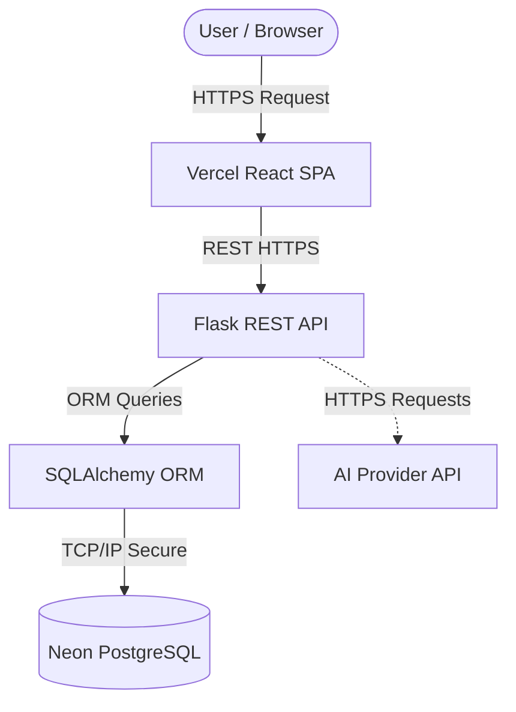

# System Architecture

This document describes the architectural layout of the Digital Museum & Virtual Museum Platform.

## 1. High-Level Overview

The system strictly adheres to a decoupled client-server model.
- **Frontend (Client)**: A React-based Single Page Application (SPA).
- **Backend (Server)**: A RESTful API driven by Flask.
- **Database**: A remote PostgreSQL instance managed by Neon.

The Frontend **never** connects directly to the Neon Database or the AI Provider. All data and logic pass through the Flask Backend layer.

## 2. Request Flow

## 3. Technology Stack
- **Frontend**: React, Vite, Tailwind CSS, Lucide Icons, React Router DOM, Axios.
- **Backend**: Python 3.12, Flask, Flask-SQLAlchemy, Flask-Migrate, Flask-Login, Werkzeug, Gunicorn (for production WSGI).
- **Database**: PostgreSQL (Neon Serverless).

## 4. Security Boundaries
- **Authentication**: Uses secure, `HttpOnly` sessions/cookies managed by `Flask-Login`.
- **Authorization**: Role-based access control (RBAC). Admin APIs are strictly protected via the `@admin_required` backend decorator.
- **Database Access**: Solely restricted to the backend service. Uses parameterization (preventing SQL injection).
- **CORS**: Strongly typed origins preventing unauthorized cross-origin requests.

## 5. Deployment Environments
- **Vercel (Frontend)**: Handles global CDN distribution of static assets.
- **Render/Railway (Backend)**: Runs the active Python instances with memory scaling and logging.
- **Neon (Database)**: Cloud-native PostgreSQL with branching capabilities.
